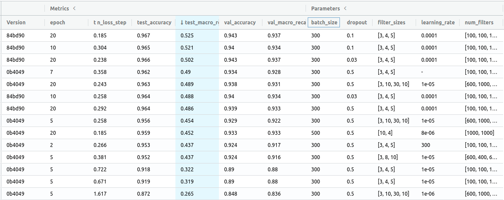
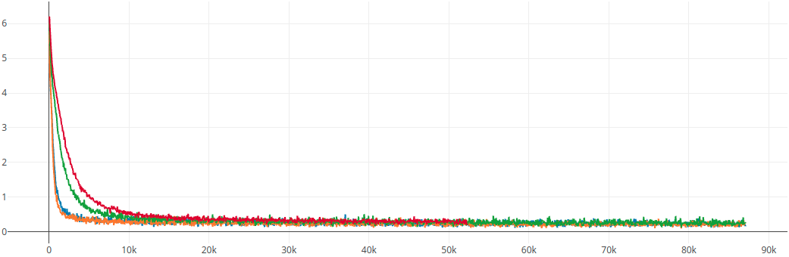
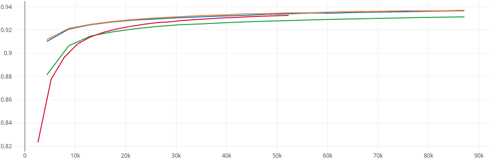
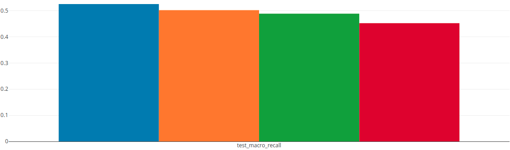
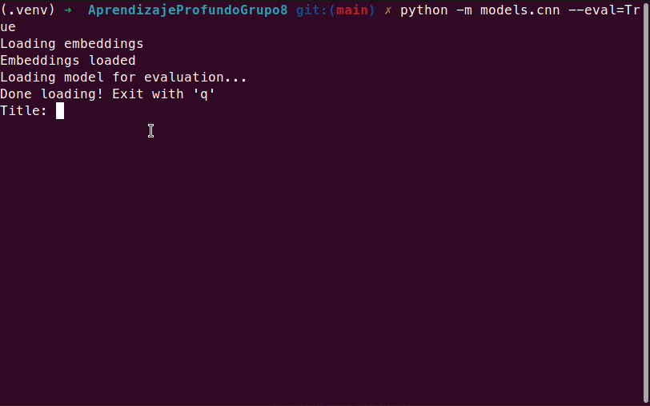

# AprendizajeProfundoGrupo8
Práctico aprendizaje profundo DiploDatos 2021 FaMAF

Integrantes:
- Alvarez, Juan
- Carrion, Nicolas
- Delgado, Gabriel
- Heredia, Gonzalo
- Ramos, Matias 

# Introduccion

En el repositorio se encuentra la resolucion del trabajo practico en el cual se presento como desafio, el dataset del MeLi challengue.
Este dataset contiene informacion sobre el titulo de productos que se encuentran a la venta en el marketplace de mercado libre
y la categoria a la que pertenecen (hay 632 posibles).
Cabe aclarar que nosotros a la hora de la experimentacion, utilizamos las 100 categorias mas populares y un conjunto reducido del dataset en español de mas de 1 millon de datos.
Nuestro aproach fue enfocarse en crear una estructura general, que posteriormente pudiera ser utilizada con la cantidad de datos y parametros que se necesite.

# Instalación

Como conveniencia, se provee un archivo `pyproject.toml` que puede ser instalado con [poetry](https://python-poetry.org/), simplemente con el comando `poetry install`.

Se deben configurar los parámetros ubicados en `utils.params`.

Luego deben cargarse los datasets con el loader. Los archivos .gz deben estar previamente descomprimidos. Se provee el utilitario `utils.loader` para cargar los dataset en un archivo `pickle` para cargar más rápidamente durante la fase de entrenamiento.

`python -m utils.loader spanish.test.jsonl spanish.test.pkl --categories=True`

El argumento `--categories=True` toma del dataset solo las categorías seleccionadas. Las mismas deben cargarse en un archivo pickle llamado `selected_top_cats.pkl`.

# Preprocesamiento 

No se aplicó una *tokenización* diferente a los datos suministrados por el equipo docente. Se utilizó la columna `tokenized_title` como entrada de nuestros modelos. Sobre estos tokens se entrenó un *embedding* utilizando FastText implementado por [gensim](https://radimrehurek.com/gensim/models/fasttext.html). Los vectores resultantes son cargados por el DataLoader del modelo, donde se convierten tokens a tensores, y entregados a la capa de entrada de pyTorch.

Para estructurar mejor el código, se utilizó la librería [pyTorch Lightning](https://www.pytorchlightning.ai/), que además de mejorar en general la estructura y reproducibilidad de los modelos de torch, también mejora el logging en MLFlow y otras herramientas.

# Entrenamiento de modelos 

Se utilizaron 2 arquitecturas a la hora de implementar los modelos. Primero se realizaron experimentos con un **MLP** con el fin de empezar a introducirnos en algunos conceptos basicos. Este modelo tenia varios parametros por defecto y nos dio resultados bastantes buenos.
Posteriormente y para cumplir con el enunciado del practico, se utilizo un **CNN**, primero con parametos por defecto y luego fuimos experimentando con otros valores. En el codigo se dejó una version en la cual uno puedo setear los parametros con los cuales se puede probar. El modelo de CNN acepta los siguientes parámetros:

```
CNNClassifier:
  --filter_sizes [FILTER_SIZES [FILTER_SIZES ...]]
  --num_filters NUM_FILTERS [NUM_FILTERS ...]
  --dropout DROPOUT
  --batch_size BATCH_SIZE
  --learning_rate LEARNING_RATE
```

También se pueden parametrizar detalles del entrenamiento. Ver más corriendo `python -m models.cnn --help`.

# Evaluacion

Todos los resultados que fuimos obteniendo los almacenamos en ML-Flow para ir teniendo un seguimiento de los mismos. Algunas capturas de nuestros runs de ML-Flow.

- Los resultados obtenidos de las corridas de los diferentes parámetros



- Progreso de loss por step



- Progreso por epoch del *recall* del conjunto de validación



- Resultados de *recall* para cada corrida sobre el conjunto de test



Tambien almacenamos el mejor modelo obtenido, en un [archivo de drive](https://drive.google.com/drive/folders/1jSpU9DA6YVLXgvlD-dNOzTCuVop0Fcl-?usp=sharing)  para hacer pruebas con nuevos datos y experimentar los resultados del modelo. El script del modelo puede ejecutarse pasando el argumento `--eval=True` para realizar pruebas de evaluación. Es satisfactorio ver al modelo en acción:



# Conclusiones

- Se logró entrenar satisfactoriamente un modelo CNN, aunque los resultados no fueron ideales.
- Aunque se intentó con diferentes hiperparámetros, el modelo parece llegar a un mínimo luego del cual no mejora demasiado. Debería probarse con diferentes arquitecturas y estrategias de pre-procesamiento.
- Las herramientas de logging como ML Flow son claves en la investigación de los modelos, dada la cantidad de corridas que son necesarias para parametrizar correctamente un modelo de estas características.
- Tuvimos una buena experiencia trabajando con pyTorch Lightning como una forma de organizar mejor el código de torch.

